# MYO EMG SANDBOX

An experimental platform for developing, validating, and benchmarking EMG-based human-computer interaction techniques. The repository serves as a research sandbox where new signal-processing pipelines, machine learning models, and interaction paradigms are evaluated before integration into production projects.

## Problem

Reliable EMG-based human-computer interaction remains challenging due to signal variability, sensor placement, muscular fatigue, electrical noise, and differences between users.

Building practical EMG interfaces requires more than training classifiers—it demands reproducible experimentation, robust preprocessing pipelines, and systematic validation of every stage in the signal-processing workflow.

This repository exists to explore those challenges through iterative experimentation before integrating validated techniques into production systems.

## Research Goals

The project currently focuses on:

- Understanding the characteristics of low-cost EMG acquisition.
- Building reproducible preprocessing pipelines.
- Comparing feature extraction techniques.
- Evaluating machine learning models for gesture recognition.
- Measuring latency for real-time interaction.
- Investigating robustness across users and recording sessions.
- Designing reusable software components for future EMG projects.

## Current Experiments

| Experiment             | Description                                                                            | Status                                             |
| ---------------------- | -------------------------------------------------------------------------------------- | -------------------------------------------------- |
| Signal preprocessing   | Exploring filtering, normalization and windowing strategies to improve signal quality. | In progress                                        |
| Feature extraction     | Evaluating statistical, temporal and frequency-domain descriptors.                     | In progress                                        |
| Gesture classification | Comparing different machine learning approaches for real-time prediction.              | In progress                                        |
| Latency benchmarking   | Measuring acquisition, preprocessing and inference latency.                            | In progress                                        |
| Noise reduction        | Investigating methods for reducing electrical interference and motion artifacts.       | In progress(See [docs](./docs/noise-reduction.md)) |
| Sensor calibration     | Studying calibration procedures to improve consistency across recording sessions.      | In progress                                        |

## Architecture

```mermaid
flowchart LR

subgraph Stage1["Stage 1 · Signal Acquisition"]
    EMG[EMG Sensor]
    MCU[ESP32 / Arduino]
    Stream[Serial / BLE Stream]
end

subgraph Stage2["Stage 2 · Research Platform"]
    Python[Python Sandbox]
    DSP[Signal Processing]
    Features[Feature Extraction]
    Models[ML Models]
    Metrics[Validation & Benchmarking]
end

subgraph Stage3["Stage 3 · Visualization"]
    Blender[Blender Hand]
    Viz[Real-time Visualization]
end

subgraph Stage4["Stage 4 · Control"]
    API[Control API]
    Drivers[Servo Drivers]
    Firmware[Firmware]
end

subgraph Stage5["Stage 5 · Prosthetic"]
    Prosthetic[Robotic Prosthetic Hand]
    Feedback[Closed-loop Feedback]
end

EMG --> MCU
MCU --> Stream
Stream --> Python

Python --> DSP
DSP --> Features
Features --> Models
Models --> Metrics

Models --> Viz
Viz --> Blender

Models --> API
API --> Drivers
Drivers --> Firmware
Firmware --> Prosthetic

Prosthetic --> Feedback
Feedback --> Python

%% Completed
style EMG fill:#b7e4c7,stroke:#2d6a4f,stroke-width:2px
style MCU fill:#b7e4c7,stroke:#2d6a4f,stroke-width:2px
style Stream fill:#b7e4c7,stroke:#2d6a4f,stroke-width:2px

%% In Progress
style Python fill:#ffe8a1,stroke:#b58900,stroke-width:2px
style DSP fill:#ffe8a1,stroke:#b58900,stroke-width:2px
style Features fill:#ffe8a1,stroke:#b58900,stroke-width:2px
style Models fill:#ffe8a1,stroke:#b58900,stroke-width:2px
style Metrics fill:#ffe8a1,stroke:#b58900,stroke-width:2px

%% Planned
style Blender fill:#ececec,stroke:#888888
style Viz fill:#ececec,stroke:#888888
style API fill:#ececec,stroke:#888888
style Drivers fill:#ececec,stroke:#888888
style Firmware fill:#ececec,stroke:#888888
style Prosthetic fill:#ececec,stroke:#888888
style Feedback fill:#ececec,stroke:#888888
```

| Stage                 | Status      |
| --------------------- | ----------- |
| 1. Signal Acquisition | Done        |
| 2. Research Platform  | In progress |
| 3. Visualization      | To do       |
| 4. Control            | To do       |
| 5. Prosthetic         | To do       |

## Current Findings

Some recurring observations from ongoing experiments include:

- ## Signal quality is heavily influenced by electrode placement.
-
- Small preprocessing changes can significantly affect classifier stability.
- Real-time constraints favor simpler feature pipelines over computationally expensive models.
- Consistent calibration appears more valuable than increasing model complexity.

## Future Directions

Planned research includes:

- Deep learning approaches for temporal EMG modeling.
- Sensor fusion with IMUs.
- Adaptive calibration techniques.
- Continuous gesture recognition.
- Online learning.
- Hardware improvements (Battery calculations aren't promising).
- Integration with CAMI as the validated experimental backend.

## References

- LibEMG
- Ninapro Dataset
- Myo Armband research
- EMGFlow
- Relevant IEEE papers (papers folder)
